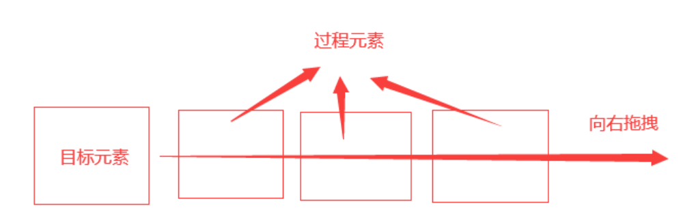
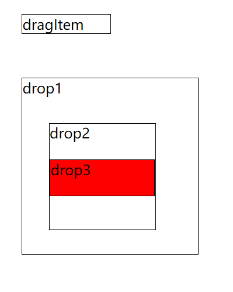
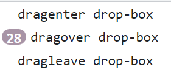

# 简介

`easy-dnd`是使用原生 [Drag and Drop](https://developer.mozilla.org/zh-CN/docs/Web/API/HTML_Drag_and_Drop_API/Drag_operations)  api 封装的一套可以应用与复杂场景下的拖拽库，它屏蔽和解决了很多实际运用场景下原生`api`的一些[问题](#h5元素拖拽api的问题)，此库专注于`web`端，完全不适用于任何触摸设备，好处的显而易见的，`easy-dnd`的核心代码体积大约只有 `9KB`左右，`gzip`下只有`3KB`左右

`easy-dnd`不依赖与任何一个前端框架，由于不经过这些框架的运行时，因此可以直接用于浏览器环境中，性能得到了最佳保证，当然 `easy-dnd` 也提供了`vue` 和 `react` 的桥接方法，对于没有适配的前端框架，也可以极其容易的扩展


## 安装

可以直接使用任何一个你喜欢用的包管理工具安装`easy-dnd`

- npm

```shell:no-line-numbers
$ npm i easy-dnd
```

- pnpm

```shell:no-line-numbers
$ pnpm i easy-dnd
```

- yarn

```shell:no-line-numbers
$ yarn add easy-dnd
```


## 原生拖拽api 快速上手

如果你已经会了原生的 Drag and Drop api，那么可以跳过这个章节，如果你还不会，可以直接查看[MDN的官方文档](https://developer.mozilla.org/zh-CN/docs/Web/API/HTML_Drag_and_Drop_API/Drag_operations)，也可以通过以下的说明文档学习。当然你也可以不了解原生`api`的使用，直接查阅 `easy-dnd` 的使用说明

### 给dom元素添加拖拽特性

dom元素想要拖拽，只需要给dom绑定一个draggrable属性，就可以让这个dom添加上拖拽特性

```html{9}
<style>
  #box {
    width: 100px;
    height: 100px;
    background-color: red;
  }
</style>

<div id="box" draggable="true"></div>
```

### 拖拽事件

`h5`对于可拖拽的元素，提供了下面三个事件用于拖拽监听

- **dragstart：** 拖拽开始
- **drag：** 拖拽中
- **dragend：** 拖拽结束

```html
<div id="box" draggable="true"></div>

<script>
  
  box.addEventListener('dragstart', function(e){
    console.log('拖拽开始')
  })

  box.addEventListener('drag', function(e){
    console.log('拖拽中')
  })
  
  box.addEventListener('dragend', function(e){
    console.log('拖拽结束')
  })
  
</script>
```

### 拖拽过程事件

当有个可以拖拽的元素之后，元素在拖拽的过程中，会经过一些元素，这里给他取一个形象一点的名称：过程元素



可以给这些过程元素绑定三个事件

- **dragenter：** 拖拽元素进入该`dom`时触发
- **dragover：**  拖拽元素在该`dom`范围内触发
- **dragleave：** 拖拽元素离开该`dom`时触发

```html
<div id="process">过程元素</div>

<script>
    
  process.addEventListener('dragenter', function(e){
    console.log('拖拽元素进入')
  })

  process.addEventListener('dragover', function(e){
    console.log('拖拽元素移动')
  })
  
  process.addEventListener('dragleave', function(e){
    console.log('拖拽元素离开')
  })
  
</script>
```

### 放置事件

当有可以拖拽的元素之后，总是需要有一个用于放置的地方，这个地方取一个形象的名称叫做**目标元素**。可以给目标元素绑定一个事件

- **drop：** 拖拽元素松开的位置在目标元素中

```html
<div id="target">目标元素</div>

<script>
    
  target.addEventListener('drop', function (e) {	
    console.log('松开')
  })
    
</script>
```

你可以尝试拖拽，并放置之后，会发现，这个函数根本没有被触发，这是因为还需要给目标元素再绑定一个事件 dragover，然后在这个函数中，执行阻止默认行为，表示允许拖拽元素放置在此元素中

```html{5-7}
<div id="target">目标元素</div>

<script>

  target.addEventListener('dragover', function (e) {	
	e.preventDefault()
  })
    
  target.addEventListener('drop', function (e) {	
    console.log('松开')
  })
    
</script>
```

这样，`drop`事件就会触发

## 原生拖拽api的问题

看过上方的文档，你一定会觉得，拖拽好像也不是很难，一个属性，7个事件。但是如果你真的直接使用上面的事件与`api`开发过复杂拖拽应用的话，一定会记忆尤新。因为不进行一系列”优化"的话，基本是不可用的。接下来就来仔细讲解一下，实际运用遇到的坑

###	drop元素存在多层HtmlElement

我们先看一个例子

```html
<div class="drag-box" style="border: 1px double;width:100px; margin: 50px" draggable="true">
  dragItem
</div>

<div 
  class="drop1-box" 
  style="border: 1px solid;width:200px; height: 200px;margin: 50px;"
>
  drop1

  <div 
    class="drop2-box" 
    style="border: 1px solid;width:120px; height: 120px;margin: 30px;"
  >
    drop2
    <p
      class="drop3-box" 
      style="border: 1px solid;background: red;margin-top: 20px;height:40px"
    >
      drop3
    </p>
  </div>

</div>


<script>

  const drop1 = document.querySelector('.drop1-box')

  drop1.addEventListener('dragleave', (e) => {
    console.log('dragleave', e.target.className)
  })

  drop1.addEventListener('dragenter', (e) => {
    console.log('dragenter', e.target.className)
  })

</script>
```

<center>
    
</center>

给`drop-box`绑定了`dragenter`，`dragover`（这里不绑定了，与另外两个事件同理），`dragleave`事件

```html
const dropBox = document.querySelector('.drop-box')

dropBox.addEventListener('dragenter', (e) => {
	console.log('dragenter', e.target.className)
})

dropBox.addEventListener('dragleave', (e) => {
	console.log('dragleave', e.target.className)
})
```

如果只在`drop1`与`drop2`之间移动，那么一切事件触发表现性状与第一章节一样

<center>
    
</center>


注意，`drop2`与`drop3`也在`drop-box`的范围内，按理来说，在`drop2`与`drop3`范围内移动的时候，控制台依旧只会打印 `drop-box`的数据。但是，在具体操作过程中，表现形式如下

<center>
    
</center>


执行`1`操作的时候，控制台打印

```console:no-line-numbers
dragenter drop1-box
```

执行`2`操作的时候，控制台打印

```console:no-line-numbers
dragenter drop2-box
dragleave drop1-box
```

执行`3`操作的时候，控制台打印

```console:no-line-numbers
dragenter drop3-box
dragleave drop2-box
```

执行`4`操作的时候，控制台打印

```console:no-line-numbers
dragenter drop2-box
dragleave drop3-box
```

执行`5`操作的时候，控制台打印

```console:no-line-numbers
dragenter drop1-box
dragleave drop2-box
```

执行`6`操作的时候，控制台打印

```console:no-line-numbers
dragleave drop1-box
```

主要原因还需要了解一下，在日常开发中最常用的两种元素

- Text节点：使用`document.createTextNode`创建的节点
- HTMLElement节点：使用`document.createElement`创建的节点

如果所绑定的`drag`等相关子元素中，只存在`Text`，伪元素等节点，那么并不会存在上面问题，上面的问题只会出现在进入`HtmlElement`子节点中时出现


###	子节点也绑定了drop

在复杂应用中，不会只给最外层元素绑定`drop`等事件，还会给子节点，子孙节点等等无限嵌套节点绑定`drop`事件，这里先探讨两层的情况下的例子，无限嵌套其实同理。比如接着上一节的例子，给`drop3`绑定相关事件

```js
const drop3 = document.querySelector('.drop3-box')
drop3.addEventListener('dragleave', (e) => {
    console.log('drop3 dragleave', e.target.className)
})

drop3.addEventListener('dragenter', (e) => {
    console.log('drop3 dragenter', e.target.className)
})
```

事件触发逻辑如下

<center>
    
</center>


执行`1`操作的时候，控制台打印

```console:no-line-numbers
drop1 dragenter drop1-box
```

执行`2`操作的时候，控制台打印

```console:no-line-numbers
drop1 dragenter drop2-box
drop1 dragleave drop1-box
```

执行`3`操作的时候，控制台打印

```console:no-line-numbers
drop3 dragenter drop3-box
drop1 dragenter drop3-box
drop1 dragleave drop2-box
```

执行`4`操作的时候，控制台打印

```console:no-line-numbers
drop1 dragenter drop2-box
drop3 dragleave drop3-box
drop1 dragleave drop3-box
```

执行`5`操作的时候，控制台打印

```console:no-line-numbers
drop1 dragenter drop1-box
drop1 dragleave drop2-box
```

执行`6`操作的时候，控制台打印

```console:no-line-numbers
drop1 dragleave drop1-box
```


###	自己既可以drag也可以drop

如果某一个元素自己又可以拖拽，又允许`drop`，那么就会出现自己的子节点可以是自己的情况。例子如下，当然这个只是简化模型，具体情况比这个复杂，比如祖先节点拖到十八代孙节点下

```html
<div class="drag-box" style="border: 1px double;width:100px; margin: 100px" draggable="true">
  dragItem
</div>

<script>

  const drag = document.querySelector('.drag-box')

  drag.addEventListener('dragover', (e)=>e.preventDefault())

  drag.addEventListener('drop', (e)=>{
    console.log('drop')
  })

</script>
```

