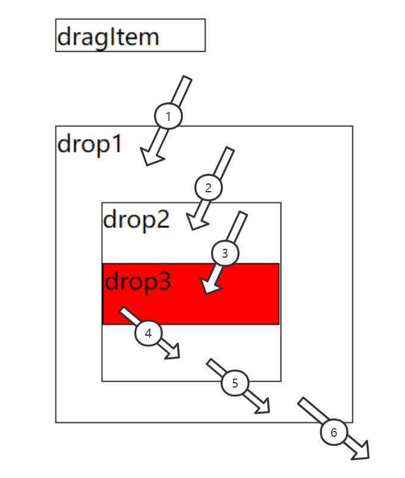
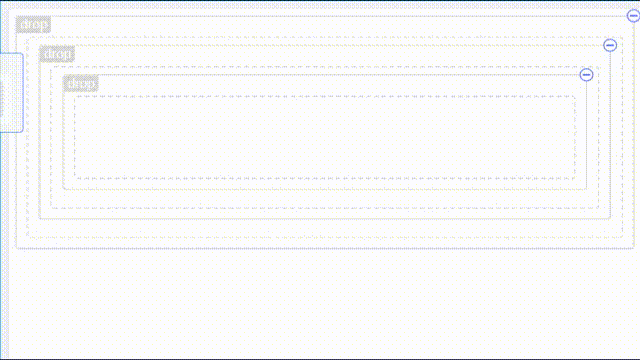
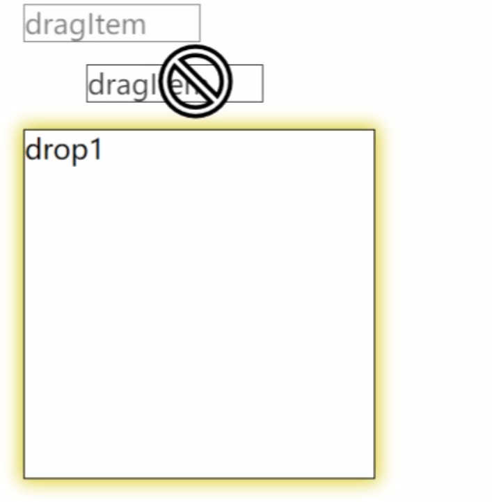
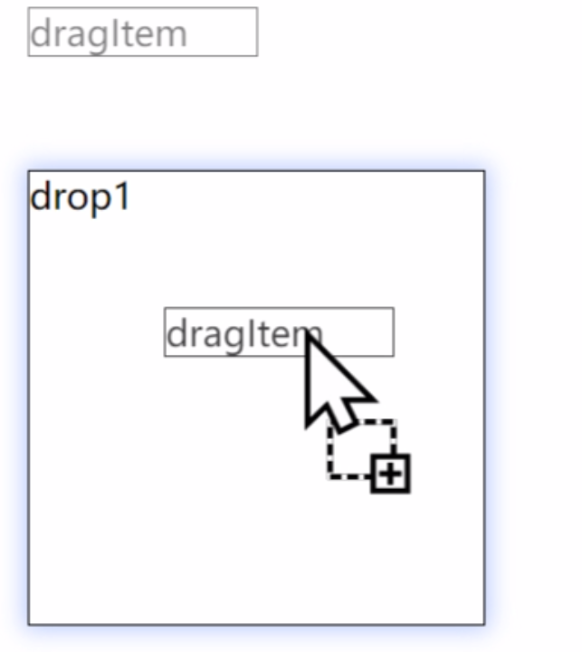

# 进阶

## 上下文高阶配置

### 拖拽模式

在创建拖拽上下文的时候，可以指定拖拽模式，默认值是 `DND_MODE.SWARAJ`

```ts{8}
enum DND_MODE {
  SCOPE = 'scope',
  SWARAJ = 'swaraj'
}

interface ProviderConfig {
    /** 拖拽类型，有 SCOPE 和 SWARAJ 两种可选 */
    dndMode?: DND_MODE;
    /** 拖拽延时时间，必须大于等于0 */
    delay?: number;
}

/**
 * 创建拖拽作用域下的基本数据
 * @param {ProviderConfig} param
 * @returns
 */
function createProvider<Data, Rubbish>(params?: ProviderConfig): IDnDProvider<Data, Rubbish>;
```

`DND_MODE.SWARAJ`的效果，可以看下面多层级嵌套的例子

```html
<div class="drag-box" style="border: 1px double;width:100px; margin: 50px" >
  dragItem
</div>

<div 
  class="drop1-box" 
  style="border: 1px solid;width:200px; height: 200px;margin: 50px;"
>
  drop1

  <div 
    class="drop2-box" 
    style="border: 1px solid;width:120px; height: 120px;margin: 30px;"
  >
    drop2
    <p
      class="drop3-box" 
      style="border: 1px solid;background: red;margin-top: 20px;height:40px"
    >
      drop3
    </p>
  </div>

</div>

<script type="module">

  import {
    createProvider,
    DragCore,
    DropCore
  } from 'easy-dnd'

  // 创建拖拽上下文
  const context = createProvider()

  // 创建一个拖拽类型
  const DRAG_TYPE = 'a'

  function createDrop(domClassName) {
    // 创建放置实例
    const drop = new DropCore({
      config: {
        context,
        acceptType: new Set([DRAG_TYPE]),
      },
      dragEnter() {
        console.log(`${domClassName}：dragEnter`)
      },
      dragLeave() {
        console.log(`${domClassName}：dragLeave`)
      },
      drop() {
        console.log(`${domClassName}：drop`)
      }
    })
      .registerDom(document.querySelector(`.${domClassName}`))
      .subscribe()
  }

  new DragCore({
    config: {
      type: DRAG_TYPE,
      context
    }
  })
    .registerDom(document.querySelector('.drag-box'))
    .subscribe()

  createDrop('drop1-box')
  createDrop('drop2-box')
  createDrop('drop3-box')

</script>
```

<center>
    
</center>

执行`1`操作的时候，控制台打印

```console:no-line-numbers
dragenter drop1-box
```

执行`2`操作的时候，控制台打印

```console:no-line-numbers
dragenter drop2-box
dragleave drop1-box
```

执行`3`操作的时候，控制台打印

```console:no-line-numbers
dragenter drop3-box
dragleave drop2-box
```

执行`4`操作的时候，控制台打印

```console:no-line-numbers
dragenter drop2-box
dragleave drop3-box
```

执行`5`操作的时候，控制台打印

```console:no-line-numbers
dragenter drop1-box
dragleave drop2-box
```

执行`6`操作的时候，控制台打印

```console:no-line-numbers
dragleave drop1-box
```

### DND_MODE.SCOPE

如果在创建上下文的时候，把默认修改为 `DND_MODE.SCOPE`

```js{5,10}
import {
  createProvider,
  DragCore,
  DropCore,
  DND_MODE
} from 'easy-dnd'

// 创建拖拽上下文
// const context = createProvider()
const context = createProvider(DND_MODE.SCOPE)
```

那么执行拖拽步骤的时候打印如下

<center>
    
</center>

执行`1`操作的时候，控制台打印

```console:no-line-numbers
dragenter drop1-box
```

执行`2`操作的时候，控制台打印

```console:no-line-numbers
dragenter drop2-box
```

执行`3`操作的时候，控制台打印

```console:no-line-numbers
dragenter drop3-box
```

执行`4`操作的时候，控制台打印

```console:no-line-numbers
dragleave drop3-box
```

执行`5`操作的时候，控制台打印

```console:no-line-numbers
dragleave drop2-box
```

执行`6`操作的时候，控制台打印

```console:no-line-numbers
dragleave drop1-box
```

但这种模式一般不常用

### delay

创建上下文的时候，还有一个配置参数，叫做`delay`

```ts{5}
interface ProviderConfig {
    /** 拖拽类型，有 SCOPE 和 SWARAJ 两种可选 */
    dndMode?: DND_MODE;
    /** 拖拽延时时间，必须大于等于0 */
    delay?: number;
}

/**
 * 创建拖拽作用域下的基本数据
 * @param {ProviderConfig} param
 * @returns
 */
function createProvider<Data, Rubbish>(params?: ProviderConfig): IDnDProvider<Data, Rubbish>;
```

它的目的是为了延迟dragEnter事件触发的时间，单位是`ms`，它出现的目的是为了解决多层级嵌套的时候，外层dragEnter立马触发，导致执行外层节点立马触发动画逻辑（比如translate偏移让位），内层节点跟着外层跑，导致**内层节点不好触发**dragEnter，体验感不佳（一般不需要配置，遇到此问题的时候，可以按需要设置100-200ms延迟执行dragEnter来解决这个问题）

<center>
    
</center>


## 拖拽状态与className

一般要拖拽元素在触发某个事件的时候需要添加一些样式来表示当前状态，`easy-dnd`内置了这个操作

```html{35,37,50,52}
<style>
  .dnd-hover {
    box-shadow: 0px 0px 5px 1px rgb(0, 0, 0, 1)
  }

  .dnd-dragging {
    opacity: 0.5;
  }

  .dnd-canDrop {
    box-shadow: 0px 0px 10px 2px rgb(224, 207, 16)
  }

  .dnd-dragEnter {
    box-shadow: 0px 0px 10px 2px rgba(181, 206, 255, 1)
  }
</style>

......

<script type="module">

  import { createProvider, DragCore, DropCore } from 'easy-dnd'

  const context = createProvider()

  const DRAG_TYPE = 'a'

  const drop = new DropCore({
    config: {
      context,
      acceptType: new Set([DRAG_TYPE]),
      className: {
        // 允许放置的元素进入时添加的className
        dragEnter: 'dnd-dragEnter',
        // 允许放置的元素开始拖拽添加的className
        canDrop: 'dnd-canDrop'
      }
    }
  })
    .registerDom(document.querySelector('.drop1-box'))
    .subscribe()

  new DragCore({
    config: {
      type: DRAG_TYPE,
      context,
      className: {
        // 鼠标移入的时候添加的className
        hover: 'dnd-hover',
        // 该元素拖拽中添加的className
        dragging: 'dnd-dragging'
      }
    }
  })
    .registerDom(document.querySelector('.drag-box'))
    .subscribe()

</script>
```

<center>
    
    
</center>


## canDrop

在`easy-dnd`中，可以通过 `DragCore.config.type` 和 `DropCore.config.acceptType` 来控制能否放置，但是真实情况往往更复杂。比如当前元内部只能放置一次，因此DropCore还提供了一个canDrop方法来控制是否允许放置（ 会先过滤一遍`DropCore.config.acceptType` ，通过了才会走canDrop方法）

```html{17,19-22,36-39}
<button>关闭放置</button>

<div class="drag-box" style="border: 1px double;width:100px; margin: 50px">
  dragItem
</div>

<div class="drop1-box" style="border: 1px solid;width:200px; height: 200px;margin: 50px;">
  drop1
</div>

<script type="module">

  import { createProvider, DragCore, DropCore } from 'easy-dnd'

  const context = createProvider()

  let canDrop = true

  document.querySelector('button').onclick = e => {
    canDrop = !canDrop
    e.currentTarget.innerText = `${canDrop ? '关闭' : '开启'}放置`
  }

  const DRAG_TYPE = 'a'

  const drop = new DropCore({
    config: {
      context,
      acceptType: new Set([DRAG_TYPE]),
      className: {
        // 允许放置的元素进入时添加的className
        dragEnter: 'dnd-dragEnter',
        // 允许放置的元素开始拖拽时添加的className
        canDrop: 'dnd-canDrop'
      },
      canDrop: () => {
        // 返回false表示不允许拖拽
        return canDrop
      }
    }
  })
    .registerDom(document.querySelector('.drop1-box'))
    .subscribe()

  new DragCore({
    config: {
      type: DRAG_TYPE,
      context,
      className: {
        // 鼠标移入时添加的className
        hover: 'dnd-hover',
        // 该元素拖拽中添加的className
        dragging: 'dnd-dragging'
      }
    }
  })
    .registerDom(document.querySelector('.drag-box'))
    .subscribe()

</script>
```

## monitor

在js中，事件触发的时候会产生一个Event对象，同理，`easy-dnd`在事件回调的时候，也会生成一个`Event`对象，其中包含者拖拽中会使用到的所有数据与方法

```ts
new DragCore({
  dragStart(monitor){ },
  drag(monitor){ },
  dragEnd(monitor){ }
})

new DropCore({
  dragEnter(monitor){ },
  dragOver(monitor){ },
  dragLeave(){ },
  drop(monitor){ }
})
```

### DragMonitor

`drag`相关事件回调的事件对象，具体的类型定义看这里 [ 核心API > createDragMonitor ](/api/#createdragmonitor) ，可以从中获取到当前拖拽上下文和dom事件的event 对象

```ts
const drop = new DropCore({
  ......
  dragStart(monitor){
  	  monitor.getContext()    // 使用createProvider创建的上下文
      monitor.event			  // Event
  }
})
```

### DropMonitor

`drop`相关事件回调的事件对象，具体的类型定义看这里 [ 核心API > createDropMonitor ](/api/#createdropmonitor) ，接下来来介绍下这个事件对象上几个很好用的方法

比如想要知道当前拖拽元素是否在放置元素的上 50% ，可以这么写

```js
const drop = new DropCore({
  ......
  // 进入时触发的函数
  dragOver(monitor) {
    // 拖动到前50%
    if (monitor.isOverTop()) {
      drop.dropDom.className = 'example3-enter-top'
    }
    // 拖动到后50%
    else {
      drop.dropDom.className = 'example3-enter-bottom'
    }
  },
  // 离开
  dragLeave() {
    // 拖动的控件离开此控件，还原样式
    drop.dropDom.className = ''
  },
  // 松开
  drop(monitor) {
    const isTop = monitor.isOverTop()
    console.log(`放置到${isTop ? '上' : '下'}面`)
    // 去除样式
    this.dragLeave && this.dragLeave(monitor)
  }
})
```

如果你的放置元素分为了上中下三份，可以这么判断

```jsx
// 获取盒子模型尺寸对象
const rect = monitor.getDomRect()

if (monitor.isOverTop(rect, true)) {
  console.log('拖到了 0 - 1/3 位置')
}
else if (monitor.isOverRowCenter(rect)) {
  console.log('拖到了 1/3 - 2/3 位置')
}
else {
  console.log('拖到了 2/3 - 1 位置')
}
```

同理，除了 y 轴位置判断，dropMonitor 也提供了 x 轴位置判断方法

```ts
// 获取盒子模型尺寸对象
const rect = monitor.getDomRect()

if (monitor.isOverLeft(rect, true)) {
  console.log('拖到了 0 - 1/3 位置')
}
else if (monitor.isOverColumnCenter(rect)) {
  console.log('拖到了 1/3 - 2/3 位置')
}
else {
  console.log('拖到了 2/3 - 1 位置')
}
```

## rubbish

用于存放拖拽具体业务逻辑中的一些数据，相当于一个全局仓库，你想存放的任何东西都可以丢这里面，而不是在你的业务代码中专门创建一个全局变量存储它

```ts{14,26}
import { createProvider, DragCore, DropCore } from 'easy-dnd'

const context = createProvider()

// 创建一个拖拽类型
const DRAG_TYPE = 'a'

const drop = new DropCore({
  config: {
    context,
    acceptType: new Set([DRAG_TYPE])
  },
  drop(monitor){
    console.log(monitor.getRubbish().saveData)
  }
})
  .registerDom(document.querySelector('.drop1-box'))
  .subscribe()

new DragCore({
  config: {
    type: DRAG_TYPE,
    context
  },
  dragStart(monitor){
	monitor.getRubbish().saveData = 1
  }
})
  .registerDom(document.querySelector('.drag-box'))
  .subscribe()
```

## 关闭拖拽

某些时候，开发者想要动态控制是否允许拖拽，那么可以这么做

```html{18,26-29}
<button>允许拖拽</button>

<div class="drag-box" style="border: 1px double;width:100px; margin: 50px">
  dragItem
</div>

<script type="module">

  import { createProvider, DragCore, DropCore } from 'easy-dnd'

  const context = createProvider()

  const DRAG_TYPE = 'a'

  const drag = new DragCore({
    config: {
      // 默认是否允许拖拽
      defaultDraggable: false,
      type: DRAG_TYPE,
      context
    }
  })
    .registerDom(document.querySelector('.drag-box'))
    .subscribe()

  document.querySelector('button').onclick = e => {
    drag.draggable = !drag.draggable
    e.currentTarget.innerText = `${drag.draggable ? '关闭' : '开启'}拖拽`
  }

</script>
```

## 同一个dom绑定了drag与drop

在原生事件中，如果同一个dom绑定了drag相关事件和drop相关事件，那么在拖拽过程中所有事件都会被触发，在`easy-dnd`中，如果同一个`dom`同时绑定了drag与drop，**那么自己移动到自己以及子孙节点的这个行为将会被屏蔽**

```js{1,8,12,16,21,36}
const dragDropDom = document.querySelector('.drag-box')

const drop = new DropCore({
  config: {
    context,
    acceptType: new Set([DRAG_TYPE]),
  },
  // 不会被调用
  dragEnter() {
    console.log('dragEnter')
  },
  // 不会被调用
  dragLeave() {
    console.log('dragLeave')
  },
  // 不会被调用
  drop() {
    console.log('drop')
  }
})
  .registerDom(dragDropDom)
  .subscribe()

new DragCore({
  config: {
    type: DRAG_TYPE,
    context
  },
  dragStart() {
    console.log('dragStart')
  },
  dragEnd() {
    console.log('dragEnd')
  }
})
  .registerDom(dragDropDom)
  .subscribe()
```

## 卸载

创建好drag与drop事件后，如果不使用它了，可以卸载它，防止内存泄露

```js{22-23}
......

const drag = new DragCore({
  config: {
    type: DRAG_TYPE,
    context
  }
})
  .registerDom(document.querySelector('.a'))
  .subscribe()

const drop = new DropCore({
  config: {
    context,
    acceptType: new Set([DRAG_TYPE]),
  }
})
  .registerDom(document.querySelector('.b'))
  .subscribe()

// 卸载
drag.unSubscribe()
drop.unSubscribe()

// 可以复用实例，再次绑定别的dom元素
// drag
//   .registerDom(document.querySelector('.c'))
//   .subscribe()

// drop
//   .registerDom(document.querySelector('.d'))
//   .subscribe()
```

