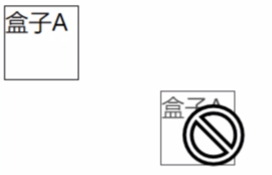
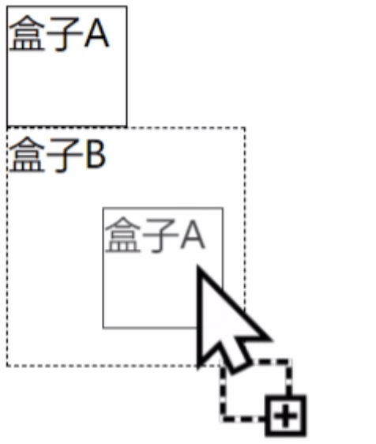

# 快速上手

## 浏览器中使用easy-dnd

在html文件顶部引入es module map

```html
<script type="importmap">
  {
    "imports": {
      "easy-dnd": "./easy-dnd.js"
    }
  }
</script>
```

接着试试导入`easy-dnd`是否生效

```html
<script type="module">
    
  import * as dnd from 'easy-dnd'

  console.log(dnd)
    
</script>
```

## 创建拖拽上下文

页面中，可能会有多个拖拽区域，这些拖拽区域之间互不影响，因此我们需要为每个区域创建各自的拖拽上下文

```js{6}
import { 
  createProvider
} from 'easy-dnd'

// 创建拖拽上下文
const context = createProvider()
```


## 创建drag对象

页面中添加一个`dom`元素，并且引入`DragCore`类，并实例化它

```html{2-6,9-11,17,27-34}
<style>
  .a {
    width: 50px;
    height: 50px;
    border: 1px solid rgb(0, 0, 0);
  }
</style>

<div class="a">
  盒子A
</div>

<script type="module">

  import {
    createProvider,
    DragCore,
  } from 'easy-dnd'

  // 创建拖拽上下文
  const context = createProvider()

  // 创建一个拖拽类型
  const DRAG_TYPE = 'a'

  // 创建拖拽对象
  const drag = new DragCore({
    config: {
      // 把拖拽类型放在这里
      type: DRAG_TYPE,
      // 关联上下文
      context
    }
  })

</script>
```

上述代码中需要配置一个`type`，至于这个`type`干什么用的，可以等如何创建drop对象说完之后再细细道来

现在页面上没有任何效果，因为还没把drag对象和原生dom元素关联在一起，添加如下代码

```js{12-13}
......

// 创建拖拽对象
const drag = new DragCore({
  config: {
    // 把拖拽类型放在这里
    type: DRAG_TYPE,
    // 关联上下文
    context
  }
})
  .registerDom(document.querySelector('.a'))
  .subscribe()
```

这样，元素就可以进行拖拽了

<center>
    
</center>


## 创建drop对象

创建drop对象同理

```html
<style>
  ...

  .b {
    width: 100px;
    height: 100px;
    border: 1px dashed rgb(0, 0, 0)
  }
</style>

...

<div class="b">
  盒子B
</div>

<script type="module">

  import {
	...
    DropCore 
  } from 'easy-dnd'
    
  ...
    
  // 创建放置实例
  const drop = new DropCore({
    config: {
      // 上下文下
      context,
      // 设置当前控件允许放置的类型，和 new Drag 中的 config.type 一一对应
      acceptType: new Set([ DRAG_TYPE ]),
    }
  })
    .registerDom(document.querySelector('.b'))
    .subscribe()

</script>
```

这样，盒子a就能拖到盒子b中，并显示允许放置的图标

<center>
    
</center>

## 为什么需要type

比如房间里有个垃圾桶，还有个箱子，我们怎么知道手中的东西需要丢到垃圾桶中还是箱子中？同理，开发者需要告诉`easy-dnd`，哪些元素可以放到哪些元素中，每个物品都有属于它自己的标识，这对应了`DragCore.config.type`

```ts
const drag1 = new DragCore({
  config: {
    type: 'A',
  }
})

const drag2 = new DragCore({
  config: {
    type: 'B',
  }
})
```

那么放置元素也需要被告知它允许放置哪些类型，对应`DropCore.config.acceptType`

```js
const drop = new DropCore({
    config: {
      acceptType: new Set([ 'A', 'B' ]),
    }
})
```


## 绑定事件

`easy-dnd`为DragCore添加了如下事件，与原生一一对应，但是做了特殊处理


- **dragStart：** 拖拽开始
- **drag：** 拖拽中
- **dragEnd：** 拖拽结束

```js
const drag = new DragCore({
  config: {
    type: DRAG_TYPE,
    context
  },
  dragStart(){
    console.log('开始拖拽')
  },
  drag(){
    console.log('拖拽中')
  },
  dragEnd(){
    console.log('结束拖拽')
  }
})
```

`easy-dnd`也为DropCore添加了如下事件


- **dragEnter：** 拖拽元素进入该`dom`时触发
- **dragOver：**  拖拽元素在该`dom`范围内触发
- **dragLeave：** 拖拽元素离开该`dom`时触发
- **drop：** 拖拽元素松开的位置在目标元素中

```js
new DropCore({
  config: {
    context,
    acceptType: new Set([DRAG_TYPE]),
  },
  dragEnter(){
    console.log('拖拽元素进入')
  },
  dragOver(){
    console.log('拖拽元素在当前元素范围内移动')
  },
  dragLeave(){
    console.log('拖拽元素离开')
  },
  drop(){
    console.log('拖拽元素放置')
  }
})
```


## 拖拽元素携带数据

在具体应用场景中，一堆物品可能同一种类型，但是它们都有各自的属性，比如，它们都是水果，但是水果有多种类型。`easy-dnd`抽象了这种关系，延伸出了 `DragCore.config.data` 配置项，示例如下

```html{31,41,54}
<div class="a1">
  盒子A1
</div>

<div class="a2">
  盒子A2
</div>

<div class="b">
  盒子B
</div>

<script type="module">

  import {
    createProvider,
    DragCore,
    DropCore
  } from 'easy-dnd'

  // 创建拖拽上下文
  const context = createProvider()

  // 创建一个拖拽类型
  const DRAG_TYPE = 'a'

  const drag1 = new DragCore({
    config: {
      type: DRAG_TYPE,
      context,
      data: () => 'a1'
    }
  })
    .registerDom(document.querySelector('.a1'))
    .subscribe()

  const drag2 = new DragCore({
    config: {
      type: DRAG_TYPE,
      context,
      data: () => 'a2'
    }
  })
    .registerDom(document.querySelector('.a2'))
    .subscribe()

  // 创建放置实例
  const drop = new DropCore({
    config: {
      context,
      acceptType: new Set([DRAG_TYPE]),
    },
    drop(monitor) {
      console.log('拖拽元素放置，放置的data为', monitor.getDragData())
    }
  })
    .registerDom(document.querySelector('.b'))
    .subscribe()

</script>
```


