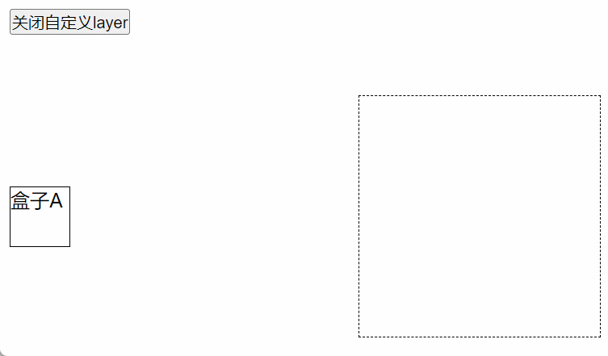

# Vue下使用

在安装`easy-dnd`的时候就会携带上 vue 相关桥接文件，所以不要单独安装

```js
import { 
  // vue下使用的拖拽上下文
  DndProvider,
  // drag hook
  useDrop,
  // drop hook
  useDrag
} from 'easy-dnd/vue'
```

可以直接从`easy-dnd/vue`中引入所有`easy-dnd`的变量和方法

```js
import { 
  DND_MODE,
  DragCore,
  DropCore,
  ...
} from 'easy-dnd/vue'
```


## DndProvider

用于提供拖拽的上下文，是基于 createProvider 的 vue 封装版本

```vue
<template>
  <dnd-provider>
    <A></A>
    <B></B>
  </dnd-provider>
</template>

<script setup lang="ts">
import { DndProvider } from 'easy-dnd/vue'
import A from './A.vue'
import B from './B.vue'
</script>
```

同理，你也可以配置dnd mode与delay

```vue{2,11}
<template>
 <dnd-provider :type="DND_MODE.SWARAJ" :delay="0">
    <A></A>
    <B></B>
  </dnd-provider>
</template>

<script setup lang="ts">
import { 
  DndProvider,
  DND_MODE
} from 'easy-dnd/vue'
import A from './A.vue'
import B from './B.vue'
</script>
```

## hooks

`easy-dnd/vue` 提供了如下两个 hooks

- **useDrag：** 用于创建拖拽实例
- **useDrop：** 用于创建放置实例

hooks的好处有以下两点

1. 不需要手动调用 subscribe 与 unSubscribe
2. 不需要传递上下文

### useDrag

```vue
<template>
  <div :ref="drag.dragRef" class="a">
    盒子A
  </div>
</template>

<script setup lang="ts">

import { useDrag } from 'easy-dnd/vue'

const drag = useDrag({
  config: {
    // 不需要传递上下文
    // context: null
    type: 'A'
  },
  dragStart: () => {
    console.log('A 开始拖拽')
  },
  dragEnd: () => {
    console.log('A 结束拖拽')
  }
})

</script>
```

### useDrop

与 useDrag 同理，同样不需要传递上下文与显性的调用  subscribe 与 unSubscribe

```vue
<template>
  <div class="b" :ref="drop.dropRef">
    盒子B
  </div>
</template>

<script setup lang="ts">
import { useDrop } from 'easy-dnd/vue'

const drop = useDrop({
  config: {
    // 不需要传递上下文
    // context: null
    acceptType: new Set(['A'])
  },
  dragEnter() {
    console.log('A进入了B的范围')
  },
  drop(monitor) {
    console.log('A放置在B上', '存放的数据:' + monitor.getDragData())
  },
  dragOver() {
    console.log('A在B中移动')
  },
  dragLeave() {
    console.log('A离开了B的范围')
  }
})

</script>
```


### useDragListen <Badge text="1.1.0+" vertical="top" />

实现全局拖拽监听

```jsx
import { ref } from 'vue'
import { useDragListen } from "easy-dnd/vue";

const listen = ref(true)

useDragListen({
  filter: () => listen.value,
  dragStart(_, context) {},
  drag(_, { dragCoord }) {},
  dragEnd() {}
})
```

你可以借助这个api实现拖拽layer的功能（<a target="_blank" href="https://github.com/bpuns/easy-dnd/blob/v1.1.0/examples/vue-demo/src/example6/Layer.vue">代码示例</a>）

<center>
    
</center>


## 既可以drag又可以drop

如果当前元素既可以drag又可以drop，你可以这么写

```vue{22}
<template>
  <li :ref="dropDragRef">
  </li>
</template>

<script setup lang="ts">

import { useDrag, useDrop } from 'easy-dnd/vue'

const drag = useDrag({
  config: {
    type: 'list'
  }
})

const drop = useDrop<number, any>({
  config: {
    acceptType: new Set(['list'])
  }
})

// 当前控件既可以拖拽，也可以放置
const dropDragRef = drop.dropRef(drag.dragRef)

</script>
```